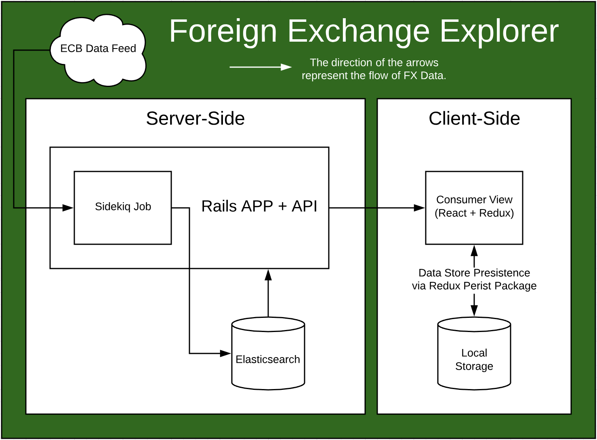

# Foreign Exchange Explorer

## Description

The purpose of this project is to fulfil the following two objectives:
- Demonstrate my approach when building a small Ruby on Rails / React web application.
- Take the opportunity to explore the use of Elasticsearch as a data store in the context of RoR.

### The Brief

The brief for this project was as follows:

- Write a Ruby library for obtaining foreign exchange rates.
- Use the [90 day European Central Bank (ECB) feed](https://www.ecb.europa.eu/stats/eurofxref/eurofxref-hist-90d.xml) as a source of data.
- Structure the code in such a way that a different source of data could easily be introduced (for the production environment for example).
- Fetch and store the exchange rate data so that the application can respond to requests without having to access the data feed.
- Provide a mechanism to fetch data from the feed once per day.

### My approach

Rather than writing a standalone ruby library (in the form of a gem), I chose to write the code that responds to the brief as the core logic within a Rails API. I also chose to include a React application that acts as a view on the exchange rate data store. This screenshot illustrates the interface for the client-side application.


**In response to the brief:**

The `ExchangeRate` class, `/lib/exchange_rate.rb`, acts as an interface for the Elasticsearch data store where the exchange rate data is stored locally. Data is imported via the `Importers::EuropeanCentralBank` class, `lib/importers/european_central_bank.rb`, which takes several options allowing for greater control around how the imported data is processed. These options are described in the 'Populating the Data Store' section of this document. Additional importers can be written for other sources of data as needs arise. These importers can be referenced inside `ExchangeRateJob#perform`, `/app/jobs/exchange_rate_job.rb`, where different importers can be used when performing the job. The `perform` method takes an options hash where the source can be declared (`{source: :ECB}` will use the EuropeanCentralBank importer for example).

The data processed by `Importers::EuropeanCentralBank` is stored in Elasticsearch via the via the `ExchangeRate` class which then delegates to the `ExchangeRateRepository`, `/lib/exchange_rate_repository.rb`, and `CurrencyRepository`, `/lib/currency_repository.rb` classes. The two repository classes interface directly with Elasticsearch using the `Currency` and `Rate` models to represent a record within the data store.

Scheduling the daily execution of the `ExchangeRateJob` is handled by the `Whenever` gem. The job scheduling is configured within `/config/schedule.rb`.

**NB:** There is an important consideration for this project that deserves its own discussion. The ECB data feed only provides exchange rates where the Euro is the base currency. This is, however, enough information to determine the exchange rates for all combinations of currencies present in the feed. While approaching this project I considered two approaches.

The first uses a naive importer which simply stores the data it receives from the feed. When a request is made using base and counter currencies not present in the data store, the `ExchangeRate` could attempt to find the inverse rate (swap the base and counter currencies) and then simply return `1 / exchange_rate`. If this approach is insufficient to determine the requested rate then a search could be made for two exchange rates that have the same base currency and a counter currency matching the base and counter currencies provided in the request. The requested rate could then be calculated by taking the ratio of these two rates: `counter_currency_rate / base_currency_rate`. The newly calculated exchange rates could then be saved back to the data store to avoid recalculations.

The other option is embed more logic within the importer and use a naive interface on top of the data store. This interface would simply look up the rate in the data store matching the request and return an error if it couldn't be found. In this scenario the importer is responsible for all of the calculations. Given a set of exchange rates all with the same base currency the importer would take the following steps:

- Save all of the exchange rates returned by the data feed.
- Save all of the inverses of these exchange rates.
- Recursively traverse the list of exchange rates calculating the rate for every combination of pairs of currencies.

It is worth noting that this exhaustive approach results in `n * (n - 1)` exchange rates where `n` is the number of currencies in the data feed.

My approach to deciding between these options was to consider which operations are most expensive and in which context the cost of an operation matters most. Searching for, not finding, and calculating a new exchange rate is far more expensive than simply searching for an existing rate. I decided that it is more important for the application to respond quickly when a request is made than to minimise how long the scheduled job takes to update the data store each day. This is, of course, assuming that the scheduled job completes within an acceptable time frame.

I decided to opt for the exhaustive combinatorial importer for the above reason, but wanted to confirm how long the job would take. Specific details for this testing can be found in the 'Populating the Data Store' section of this document, but these are the headlines.

- Populating an empty data store with all of the data present in the 90 day feed took a little under an hour.
- Populating an existing data store with a single day of data took less than a minute. As this represents the work done by the daily job I feel these times are well within the realm of what is acceptable.

The ECB feed contains rates for 33 currencies (including 'EUR'). As the time taken to complete the combinatorial approach grows non-linearly with respect to the number of currencies, the approach may need to be reconsidered if a new feed contains considerably more currencies. For example, 33 currencies results in 1,056 exchange rates where 100 currencies results in 9,900 exchange rates.

**NB:** It is worth noting that the ECB feed excludes weekends so the 90 day feed doesn't actually include 90 days of data but simply the data for the last 90 calendar days.

### Architecture

The primary components of the software architecture are illustrated below. This isn't an exhaustive entity diagram but does illustrate the flow of foreign exchange data through the server-side and client-side applications.



### API

The following API endpoints are available via the Rails application and are used to retrieve the data used by the React application.

Get...
`GET 'api/v1/exchange-rates/:base_currency/:counter_currency/?on=YYYY-MM-DD'`
Example:
```
/* GET /api/v1/exchange-rates/EUR/GBP/?on='2018-11-26' */
{
    "id": "f503af91-b294-4b97-b7ba-58f325023c76",
    "base_currency": "EUR",
    "counter_currency": "GBP",
    "value": "0.8844",
    "date": "2018-11-26"
}
```

Get...
`GET 'api/v1/exchange-rates/:base_currency/:counter_currency/?from=YYYY-MM-DD&to=YYYY-MM-DD'`
Example response:
```
/* GET /api/v1/exchange-rates/EUR/GBP/?from='2018-11-20'&to='2018-11-26' */
[
    {
        "id": "a8e709f2-7802-4acb-b38b-4de4892b9103",
        "base_currency": "EUR",
        "counter_currency": "GBP",
        "value": "0.88908",
        "date": "2018-11-20"
    },
    {
        "id": "367cdb77-282d-4416-aaa3-8ea0803b0f1a",
        "base_currency": "EUR",
        "counter_currency": "GBP",
        "value": "0.89108",
        "date": "2018-11-21"
    },
    .
    .
    .
]
```

Get a list of all the currencies for which there are exchange rates in the data store sorted by the currency code alphabetically.
`GET 'api/v1/currencies'`
Example response:
```
/* GET 'api/v1/currencies' */
[
    {
        "id": "545d7011-4d96-45bb-9812-ff63cf097e22",
        "code": "AUD",
        "symbol": "AU$"
    },
    {
        "id": "aeb7ec49-8093-4137-b021-67f48a1ea2c5",
        "code": "BGN",
        "symbol": "BGN"
    },
    .
    .
    .
]
```

Get a list of all the dates for which there are exchange rates in the data store sorted chronologically.
`GET 'api/v1/dates'`
Example response:
```
/* GET 'api/v1/dates' */
["2018-08-31", "2018-09-03", "2018-09-04", "2018-09-05", ... ]
```

## Dependencies

The project makes use of the following technologies:

- [Git](https://git-scm.com/downloads)
- [Ruby 2.5.3](https://www.ruby-lang.org/en/)
- [Rails 5.2.1](http://rubyonrails.org/)
- [Elasticsearch 6.5](https://www.elastic.co/products/elasticsearch)

The local development environment expects Elasticsearch to be reachable at `localhost:9200`.

The asynchronous jobs using Sidekiq depend upon [Redis](https://redislabs.com/).

## Setup

After cloning the repository to your local workspace, take the following steps to get the development application running:

- `bundle install`
- Start Elasticsearch. The method of starting Elasticsearch depends upon how you installed it and whether you want to run it as a daemon or not.
- `bundle exec rails s`

This will spin up the development application which can be accessed at `localhost:3000` (the default for RoR).

**NB:** The initial page load for the development environment is particularly slow as Webpacker compiles the assets for the client-side application when the first request is made.

### For Asynchronous Jobs

The scheduled jobs depend upon a local [Redis](https://redislabs.com/) server. The following commands can be executed to setup and teardown the scheduled jobs.

**NB:** I recommend reviewing `/lib/tasks/jobs.rake` before executing these commands on your machine to make sure they won't produce undesirable effects for your local environment.

- `redis-server`
This will schedule the import job to run daily at 1AM and initialise Sidekiq.
- `bundle exec rake jobs:initialise`

To stop the job worker and clear the schedule:
- `bundle exec rake jobs:teardown`

## Populating the Data Store

There are a few options for populating Elasticsearch with the exchange rate data required for the project to function.

- `bundle exec rake db:seed` This will add a set of sample data covering 6 days of exchange rates all with 'EUR' as the base currency.

These are the results of running the ECB importer with various options in the Rails console. The Elasticsearch index was cleared between each execution.
- `Importers::EuropeanCentralBank.new.import_exchange_rates` Standard import: 2.35 minutes (2,048 exchange rates)
- `Importers::EuropeanCentralBank.new({calculate_inverse: true}).import_exchange_rates` Import with inverse calculations: 2.66 minutes (4,096 exchange rates)
- `Importers::EuropeanCentralBank.new({calculate_combinations: true}).import_exchange_rates` Import with all combinations: 53.28 minutes (67,584 exchange rates)
- `Importers::EuropeanCentralBank.new({latest_n_days: 1, calculate_combinations: true}).import_exchange_rates` Same setting as the nightly job (all combinations but only 1 day of new data): 0.73 minutes (1,056 exchange rates)

If you fork this project and explore it locally, I recommend importing 10 days of data with all combinations. This will provide sufficient data to play with the client-side application and API without encountering too much missing exchange rate data. On my computer, this took 7.41 minutes to complete and imported 10,560 exchange rates.
```ruby
Importers::EuropeanCentralBank.new({
  latest_n_days: 10,
  calculate_combinations: true
}).import_exchange_rates
```

Execute this to remove the Elasticsearch indices used by this project:
`bundle exec rake elasticsearch:remove_data`

## Automated Testing

The project includes three gems used to analyse the state of the application and its dependencies These are:

- Bundler Audit: Used to determine whether the installed gems contain security vulnerabilities. Run by calling `bundle exec rake bundler:audit`.
- Rubocob: Used to perform static analysis on the ruby code in the project. Run by calling `bundle exec rubocop`.
- Rspec: Used to execute the Ruby automated tests. Run by calling `bundle exec spec`.

The three rake tasks have been chained together so they run in sequence when executing `bundle exec rake`. The chained task will fail at the first hurdle and exit.

## Opportunities for Improvement

- Integrate 3rd party analysis services such as CircleCI and CodecCimate.
- Improve the performance of the automated tests especially those that currently depend upon Elasticsearch.
- Refactor the date look up logic so it doesn't rely upon searching for 'EUR' rates and returning the unique dates associated with those rates.
- Add automated tests and static analysis for the React client-side application.
- Add a service worker to the client-side application so the app can work offline (assuming the requested dat has already been requested and cached to local storage).

## Project Management

The tasks for this project are managed via [Trello](https://trello.com/b/5VygBLKY/foreign-exchange-explorer).

## License

Chart.js is available under the [MIT license](http://opensource.org/licenses/MIT).
